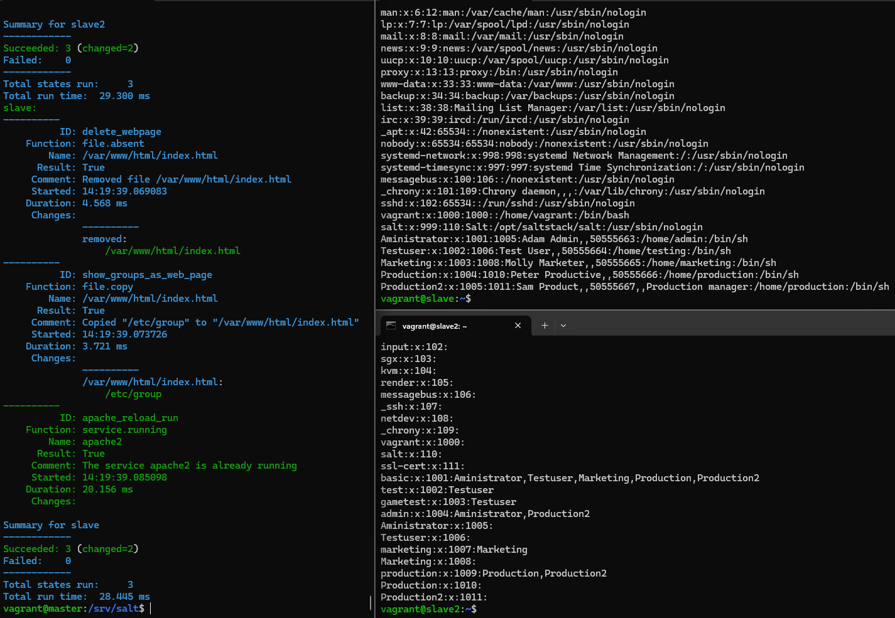

# salt-user-butler

Module for managing users and groups with saltstack




Comes with a template of users and groups

### Clone:
- You will need to clone this repository to your **/srv/salt** directory
```bash
git clone https://github.com/vaurasan/salt-user-butler.git /srv/salt
```

### Usage:

- **Ensure** certain users and groups exists, install apache2 if not already installed and make sure it is running (idempotent):
```bash
sudo salt '*' state.apply users
```
- **Get** user and group info from minions:
```bash
sudo salt '*' state.apply getusers
```
- **Show** user group info on main web page:
```bash
sudo salt '*' state.apply web-groups
```
- **Show** user info on main web page:
```bash
sudo salt '*' state.apply web-users
```
---

Tested with
- Windows 11 Pro 24H2
- Oracle VirtualBox Version 7.1.4 r165100 (Qt6.5.3) - Debian 12 GNU/Linux (bookworm)
- Vagrant 2.4.3
- salt 3007.1 (Chlorine)

---

Made by: **Santeri Vauramo** / <em>vaurasan</em> 2025
